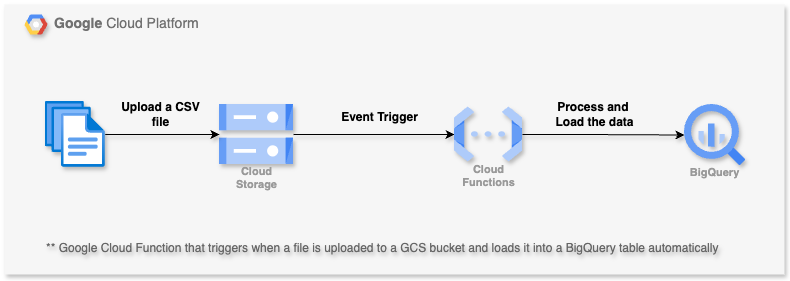

## 🛠 Project 1/50: Event driven file processing using Cloud function, GCS and BigQuery


## Event driven file processing Pipeline on Google Cloud

This project deploys a Google Cloud Function that triggers when a file is uploaded to a GCS bucket and loads it into a BigQuery table automatically.





### 🗂 Project Structure
```
├── main.py # Cloud Function handler
├── requirements.txt # Python dependencies
├── deploy.sh # Deployment script for GCP setup
└── README.md # This documentation file
```
---

### ✅ Prerequisites

- Python 3.7+
- Google Cloud SDK installed (`gcloud init`)
- Google Cloud account with billing enabled
- Enable the following APIs:
  - Cloud run functions
  - BigQuery
  - Cloud Storage
- Create or use an existing GCP project


### ✅ Use Case

Whenever a new `.csv` file is uploaded to the specified GCS bucket, this function:
1. Gets triggered by the GCS **finalize event**
2. Reads the CSV file
3. Loads the content directly into a BigQuery table (with autodetect schema)


### 🔧 Setup Instructions

#### 1. Prerequisites

- A Google Cloud Platform account
- Billing enabled on your GCP project
- Google Cloud SDK installed (`gcloud init`)
- Enable these APIs:
  - Cloud Functions
  - BigQuery
  - Cloud Storage

---

#### 1. Clone the Repository

```bash
git clone https://github.com/your-username/gcp-dataengineering-mini-projects.git
cd gcp-dataengineering-mini-projects/1.event-driven-file-processing
```

#### 2. Install Dependencies
```bash
pip install -r requirements.txt
```

### 3. Configuration

Before deploying, update the following values in `deploy.sh`:

```bash
PROJECT_ID="your-project-id"
BUCKET_NAME="your-bucket-name"
REGION="us-central1"
FUNCTION_NAME="gcs_to_bigquery"
RUNTIME="python311"

BQ_DATASET="your_dataset"
BQ_TABLE="your_table"
```

#### 4. Setup GCP Environment

This script will create a GCS bucket, BQ dataset and table, enable the necessary API services, granting service account permissions and finaly deploy the cloud function

```
chmod +x deploy.sh
./deploy.sh
```

Now your GCP Environment is Ready !!!! Now your cloud function is ready to run when new file arrives in GCS bucket


#### 🚀 Trigger the cloud function by uploading file to GCS bucket

```
gsutil cp ./sample_files/sample1.csv gs://your-bucket-name/data.csv

```

The function will trigger and load data into the specified BigQuery table.

✅ Done!
You’ve now built an event-driven data pipeline using GCS + Cloud Function + BigQuery.
