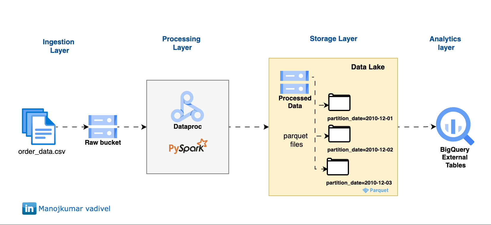

# 🌤️ Project 4/50: Batch Processing with PySpark, Dataproc & BigQuery External table on GCP

Process historical order data using PySpark on Dataproc, write partitioned Parquet files to GCS, and create a BigQuery External table on top — ready for reporting!

---



## 🛠️ Tools Used
- **Google Cloud Storage (GCS)** – for raw and processed data
- **Dataproc (PySpark)** – to clean and transform data
- **BigQuery External Table** – external table on top of partitioned GCS data
- **Looker Studio** – for interactive dashboards

---

## 📁 Project Structure

```
4.dataproc-spark-processing/
├── main.py                   # Cloud Function to fetch and write data
├── data                      # contains the input raw orders_data.csv
├── setup.sh                  # create GCS bucket, BQ dataset, load raw data
├── run_dataproc.py           # create dataproc cluster & submit the Dataproc job
└── README.md
```

---

## 🚀 How It Works

1. Uploads `order_data.csv` to GCS.
2. Submits a PySpark job to Dataproc.
   - Reads raw CSV
   - Cleans data
   - Extracts `partition_date` from `OrderDate`
   - Writes partitioned Parquet to GCS
3. Creates a **BigLake external table** pointing to GCS using Hive-style partitioning.
4. Output is queryable in BigQuery.
5. Optional: Visualize using Looker Studio.

---

## ✅ Setup

1. Edit `setup.sh` and update:
   - `PROJECT_ID`
   - `BUCKET_NAME`
   - `DATASET`
   - `TABLE`
   - `REGION`
   - `UNIQUE_KEY`


2. Run the script:

```bash
. ./setup.sh
```

3. Edit `run_dataproc.py` and update
   - `PROJECT_ID`
   - `UNIQUE_KEY`

4. Run the script to craete dataproc cluster and submit job

```
python3 run_dataproc.py
```