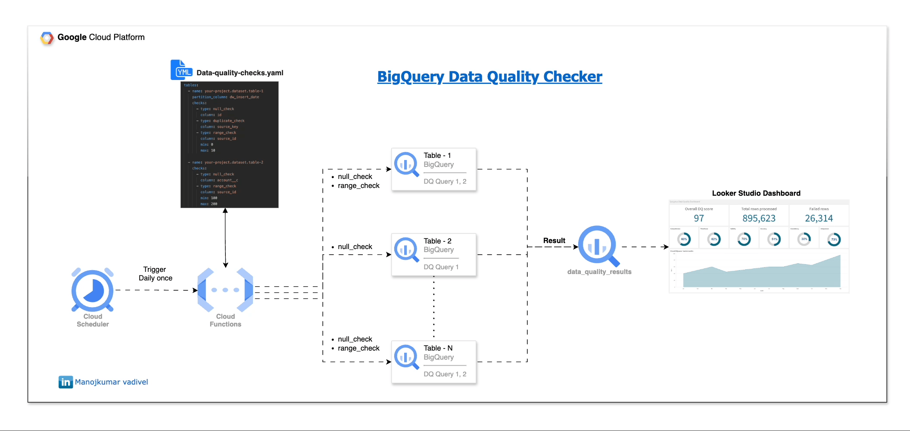

# ✅ Project 5/50: Data Quality Checks on BigQuery (GCP)

Use Cloud Functions to run basic data quality checks on partitioned BigQuery tables — automate checks like nulls, duplicates, and out-of-range values.

---



## 🛠️ Tools Used
- **Python (3.10+)**
- **BigQuery**
- **Cloud Functions**
- **Cloud Scheduler (optional)**
- **Python (PyYAML, google-cloud-bigquery)**

---

## 📁 Project Structure
```
5.data-quality-checks-framework/
├── dq_check.py # Core logic for running DQ checks
├── main.py # Cloud Function entrypoint
├── dq_config.yaml # List of tables and checks
├── setup.sh # Deploys GCP resources
├── cleanup.sh # Deletes all created resources
└── README.md
```


---

## 🧪 What It Does

- Loops through each table in the YAML config
- Applies selected DQ checks **only on today's partition**
- Inserts results into a BigQuery table `your_dataset.data_quality_results`

---

## ⚙️ dq_config.yaml Example

```yaml
tables:
  - name: project_id.dataset_id.customer_data
    partition_column: created_date
    checks:
      - type: null_check
        column: email
      - type: duplicate_check
        column: customer_id
      - type: range_check
        column: age
        min: 18
        max: 100
  ```

## ✅ Setup

1. Replace:
   - `your_dataset and your_project` in `dq_config.yaml` and `dq_check.py`

2. Run GCP setup.sh to create BigQuery monitoring table, cloud function and scheduler :

```bash
chmod +x deploy.sh
./setup.sh
```
This will:

- Create the data_quality_results table
- Deploy the Cloud Function
- Schedule it to run daily using Cloud Scheduler\

📊 Sample Output Table: data_quality_results
| partition\_date    | check\_name        | table\_name                    | failed\_rows | total\_rows | pass\_ratio | checked\_at              |
| ------------------ | ------------------ | ------------------------------ | ------------ | ----------- | ----------- | ------------------------ |
| 2024-07-10         | null\_check\_email | project.dataset.customer\_data | 5            | 1000        | 0.995       | 2024-07-10T08:00:00.000Z |


🧹 Optional Cleanup
```
. ./cleanup.sh
```


