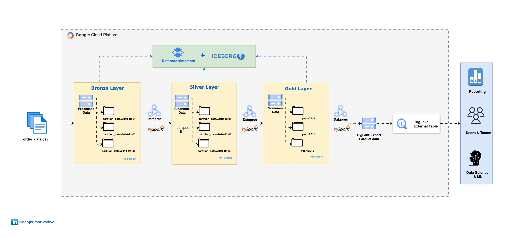

# 🏗️ Project 6/50: Medallion Architecture with Dataproc Spark & Iceberg BigQuery Tables

This project demonstrates a complete medallion architecture (Bronze-Silver-Gold) data lakehouse implementation using Google Cloud Dataproc, Apache Spark, Apache Iceberg, and BigQuery external tables with BigLake.

---



## 🛠️ Tools Used
- **Apache Spark on Dataproc**
- **Apache Iceberg** (ACID transactions, time travel, schema evolution)
- **BigQuery** (External tables with BigLake)
- **Google Cloud Storage** (Data lake storage)
- **Dataproc Metastore** (Hive metastore service)
- **Python 3.8+**

---

## 📁 Project Structure
```
6.dataproc-spark-iceberg-medallion/
├── main.py                 # Orchestration script for cluster & job management
├── setup.sh               # GCP resource provisioning script
├── requirements.txt       # Python dependencies
├── pyspark_jobs/
│   ├── config.yaml        # Medallion architecture configuration
│   ├── pyspark_job.py     # Spark ETL jobs (Bronze → Silver → Gold)
│   └── init_script.sh     # Dataproc initialization script
├── data/
│   └── input/             # Sample data files
├── bigquery_script.sql    # BigQuery external table creation
└── README.md             # This documentation
```

---

## 🏛️ Architecture Overview

### Medallion Layers:
1. **Bronze Layer** (Raw): Ingests raw CSV data with minimal transformation
2. **Silver Layer** (Cleaned): Data cleaning, validation, and enrichment
3. **Gold Layer** (Aggregated): Business-ready aggregated metrics
4. **BigQuery External**: Gold data exposed as BigQuery external tables

### Data Flow:
```
Raw CSV → Bronze (Iceberg) → Silver (Iceberg) → Gold (Iceberg) → BigQuery External Tables
```

---

## ✅ Prerequisites

- **Google Cloud Platform account** with billing enabled
- **Python 3.8+** and Google Cloud SDK (`gcloud init`)
- Enable the following APIs:
  - Dataproc API
  - Dataproc Metastore API
  - BigQuery API
  - Cloud Storage API
- **IAM Permissions:**
  - Dataproc Admin
  - Storage Admin
  - BigQuery Admin
  - Metastore Admin

---

## 🚀 Quick Start

### 1. Configuration Setup
Update the configuration in `pyspark_jobs/config.yaml`:

```yaml
gcp:
  project_id: "your-project-id"        # ← Replace with your project
  region: "europe-west2"               # ← Replace with your region

storage:
  warehouse_bucket: "your-bucket-name"  # ← Replace with your bucket
```

### 2. Deploy Infrastructure
```bash
PROJECT_ID="your-project-id"            # ← Replace with your project
```
```bash
# Make scripts executable
chmod +x setup.sh

# Provision GCP resources
./setup.sh
```

This creates:
- GCS bucket for data lake storage
- Dataproc Metastore service
- BigQuery dataset
- BigLake connection
- Sample data upload

### 3. Run Medallion Pipeline
```bash
# Install Python dependencies
pip install -r requirements.txt

# Execute the full pipeline
python main.py
```

### 4. Verify Results
```sql
-- Query the gold layer via BigQuery
SELECT
  year,
  month,
  total_quantity,
  total_revenue,
  num_orders
FROM `your-project.sales.orders_external_table`
ORDER BY year DESC, month DESC;
```

---

## 📊 Data Transformations

### Bronze Layer
- **Purpose**: Raw data ingestion with schema validation
- **Format**: Apache Iceberg tables
- **Partitioning**: By `partition_date`
- **Schema**: Original CSV schema + `partition_date` + `InvoiceTimestamp`

### Silver Layer
- **Purpose**: Data cleaning and enrichment
- **Transformations**:
  - Data type conversions
  - Date/time parsing (`InvoiceDate` → `InvoiceTimestamp`)
  - Add year, month, day columns
  - Data quality validations
- **Format**: Apache Iceberg tables
- **Partitioning**: By `partition_date`

### Gold Layer
- **Purpose**: Business metrics and aggregations
- **Transformations**:
  - Monthly aggregations by year/month
  - `total_quantity`: Sum of all quantities
  - `total_revenue`: Sum of (Quantity × UnitPrice)
  - `num_orders`: Count of unique orders
- **Format**: Apache Iceberg tables
- **Partitioning**: By `year`, `month`

---

## 🔧 Key Features

- **ACID Transactions**: Iceberg provides full ACID compliance
- **Time Travel**: Query historical versions of data
- **Schema Evolution**: Add/modify columns without breaking pipelines
- **Automatic Scaling**: Dataproc clusters auto-scale based on workload
- **BigQuery Integration**: Query Iceberg tables directly from BigQuery
- **Cost Optimization**: Idle cluster deletion after job completion

---

## 📈 Monitoring & Observability

- **Dataproc UI**: Monitor Spark jobs and cluster health
- **BigQuery**: Query and analyze processed data
- **GCS**: Monitor data lake storage and costs
- **Metastore**: Track table schemas and metadata

---

## 🧹 Cleanup

To avoid ongoing charges, clean up resources:

```bash
# Delete Dataproc cluster (if still running)
gcloud dataproc clusters delete medallion-cluster --region=europe-west2

# Delete Metastore service
gcloud metastore services delete iceberg-metastore --location=europe-west2

# Delete GCS bucket
gsutil -m rm -r gs://your-bucket-name

# Delete BigQuery dataset
bq rm -r -f your-project:sales
```

---

## 🔗 References
- [Apache Iceberg Documentation](https://iceberg.apache.org/)
- [BigQuery Iceberg Tables](https://cloud.google.com/bigquery/docs/iceberg-overview)
- [Dataproc Spark Documentation](https://cloud.google.com/dataproc/docs/concepts/overview)
- [Medallion Architecture Best Practices](https://www.databricks.com/glossary/medallion-architecture)