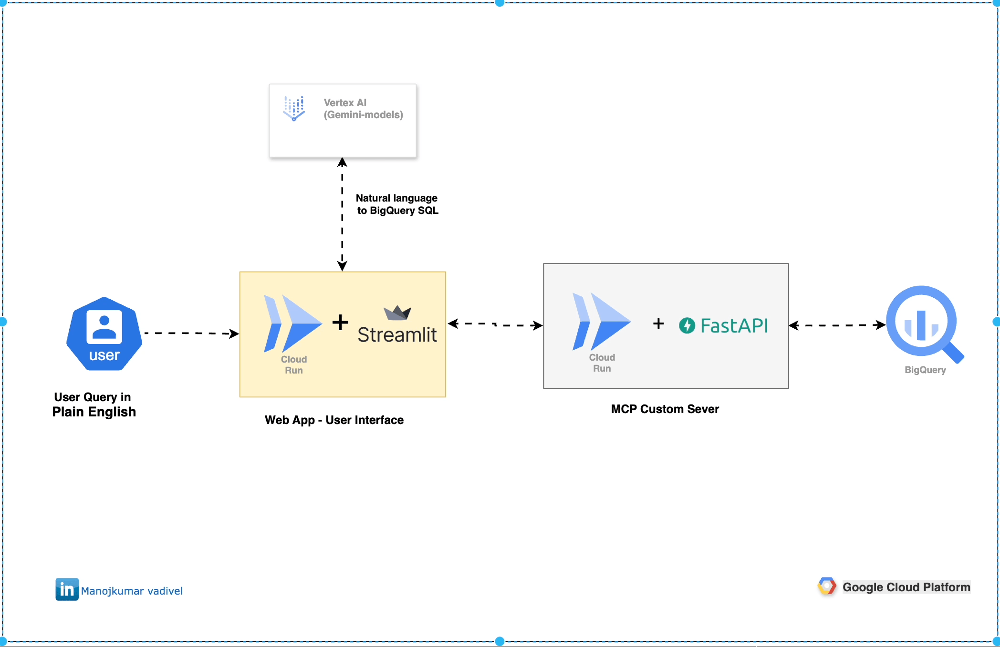

## 🛠 Project 8/50: Natural Language to BigQuery using Vertex AI and MCP Pattern

## BigQuery Vertex AI MCP Connection

Ask questions in plain English and get answers from your BigQuery data! This project uses Google's Vertex AI to convert natural language questions into SQL queries and executes them securely using the MCP (Model Context Protocol) pattern.



### 🗂 Project Structure
```
.
├── deploy-cloud.sh           # Deploy to Cloud Run
├── deploy-local.sh           # Run locally with Docker Compose
├── docker-compose.yml        # Docker Compose configuration
├── .env.example              # Configuration template
├── README.md                 # This documentation
├── setup-infra/              # Infrastructure setup scripts
│   ├── setup.sh              # GCP infrastructure deployment
│   ├── bigquery-setup.sh     # BigQuery dataset and table setup
│   ├── cleanup.sh            # Resource cleanup
│   └── sample-data.json      # Sample sales data (35 records)
├── mcp-bigquery-server/      # FastAPI MCP Server
│   ├── Dockerfile
│   ├── main.py
│   └── requirements.txt
└── streamlit-app/            # Streamlit User Interface
    ├── Dockerfile
    ├── app.py
    └── requirements.txt
```

---

### ✅ Prerequisites

- Python 3.11+
- Google Cloud SDK installed ([Download here](https://cloud.google.com/sdk/docs/install))
- Docker and Docker Compose (for local testing)
- Google Cloud account with billing enabled
- Enable the following APIs:
  - Cloud Run
  - BigQuery
  - Vertex AI
  - Cloud Build
  - IAM

---

### ✅ Use Case

This project demonstrates a natural language interface to BigQuery where users can:
1. Ask questions in plain English (e.g., "What are the total sales by region?")
2. Vertex AI (Gemini) converts the question to SQL
3. MCP server executes the query securely on BigQuery
4. Results are displayed with an AI-generated summary

**Architecture Flow:**
```
User Question → Streamlit App → Vertex AI (SQL Generation) → MCP Server → BigQuery → Results
```

---

### � Quick Setup (5 minutes)

#### 1. Clone This Repository

```bash
git clone https://github.com/your-username/gcp-dataengineering-mini-projects.git
cd gcp-dataengineering-mini-projects/8.bigquery-vertexai-mcp-connection
```

#### 2. Set Your Project ID

```bash
cp .env.example .env
nano .env  # Change 'your-project-id' to your actual Google Cloud project ID
```

#### 3. Deploy Everything to Google Cloud

```bash
chmod +x deploy-cloud.sh
./deploy-cloud.sh
```

**This single command will:**
- ✅ Enable all required Google Cloud APIs
- ✅ Create service accounts with proper permissions
- ✅ Create BigQuery dataset and load 35 sample sales records
- ✅ Deploy MCP server to Cloud Run
- ✅ Deploy Streamlit web app to Cloud Run
- ✅ Set up all security permissions automatically

#### 4. Access Your App

The script will show you the URL like:
```
✅ Deployment Complete!
Streamlit App: https://streamlit-app-xxxxx-uc.a.run.app
🌐 You can now access the app!
```

**Click the URL and start asking questions!**

---

### 🐳 Test Locally (Optional)

Want to test before deploying to the cloud?

```bash
# Install Docker first, then:
./deploy-local.sh

# Access at: http://localhost:8501
```

---

### 📊 Sample Questions to Try

Once your app is running, try these questions:

**Sales Analysis:**
- "What are the total sales by region?"
- "What was the total revenue in February?"

**Customer Insights:**
- "Who are the top 3 customers by revenue?"
- "How many unique customers do we have?"

**Product Analysis:**
- "How many laptops were sold?"
- "What's the average order value?"

**Regional Analysis:**
- "Show me all orders from the North region"
- "Which region has the highest sales?"

---

### 🛠 Configuration Options

**Want to use a different AI model?** Edit your `.env` file:

```bash
# Fast and cheap (default)
VERTEX_AI_MODEL=gemini-2.5-flash

# More accurate but slower
VERTEX_AI_MODEL=gemini-2.5-pro

# Most stable across all regions
VERTEX_AI_MODEL=gemini-pro
```

**Want to use a different region?**

```bash
REGION=europe-west1  # or your preferred region
LOCATION=europe-west1
```

---

### 🧹 Clean Up (Remove Everything)

When you're done experimenting:

```bash
cd setup-infra
./cleanup.sh
```

This removes all created resources so you won't be charged.

---

### 🔧 Troubleshooting

**Problem: "403 Forbidden" when accessing the app**
```bash
# Run this command:
gcloud run services add-iam-policy-binding streamlit-app \
  --region=us-central1 \
  --member="allUsers" \
  --role="roles/run.invoker"
```

**Problem: "Model not found" error**
- Change `VERTEX_AI_MODEL=gemini-pro` in your `.env` file and redeploy

**Problem: BigQuery permissions error**
- The script should handle this automatically. Try redeploying.

**Problem: Docker issues on local testing**
- Make sure Docker is installed and running
- Try: `docker compose down` then `./deploy-local.sh`

---

### 💡 How It Works

1. **You ask a question** in the Streamlit web interface
2. **Vertex AI (Gemini)** converts your question to SQL
3. **MCP Server** securely executes the query on BigQuery
4. **Results are displayed** with an AI-generated summary

**Security:** The MCP server acts as a secure proxy - users can't directly access BigQuery, only through the controlled interface.

---

### 📚 Next Steps

- **Add your own data:** Replace the sample data in `setup-infra/sample-data.json`
- **Customize questions:** Modify the sidebar examples in `streamlit-app/app.py`
- **Add more tables:** Extend the schema in the prompts
- **Deploy to production:** Add authentication and monitoring

---

✅ **Done!**
You now have a working natural language interface to BigQuery!

**Cost:** This demo uses minimal resources and should cost less than $1-2 per day if left running.