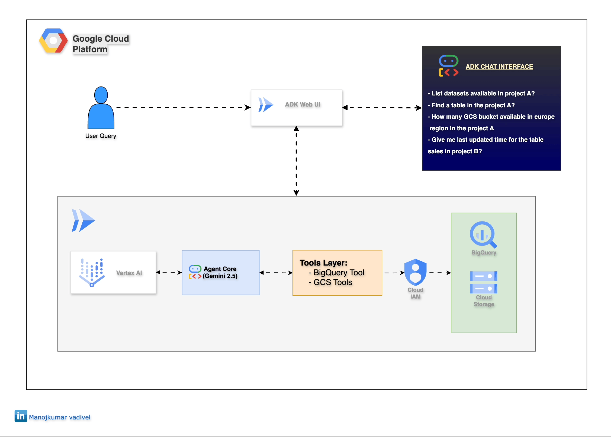

# 🤖 Project 9: Google Agent SDK GCP Assistant

An AI agent built with Google's Agent Development Kit (ADK) that provides intelligent assistance for Google Cloud Platform operations through natural language queries.

---



## �️ Tools Used

- **Google Agent SDK (ADK)** - Agent framework
- **Gemini 2.5 Flash** - LLM model
- **Cloud Run** - Serverless hosting
- **BigQuery** - Data warehouse queries
- **Cloud Storage** - File operations
- **Cloud Build** - Container image building

---

## 📁 Project Structure

```
.
├── agent/
│   ├── __init__.py
│   ├── agent.py              # Main agent configuration
│   └── tools/
│       ├── __init__.py
│       ├── bq_tools.py       # BigQuery operations
│       └── gcs_tools.py      # Cloud Storage operations
├── Dockerfile                # Container configuration
├── docker-compose.yml        # Local Docker setup
├── requirements.txt          # Python dependencies
├── setup.sh                  # Initial GCP setup
├── deploy.sh                 # Deploy to Cloud Run
├── cleanup.sh                # Remove resources
├── env.example               # Environment template
└── .gitignore                # Git ignore rules
```

---

## ✅ Prerequisites

- Python 3.11+
- Google Cloud SDK installed (`gcloud init`)
- Google Cloud account with billing enabled
- Google API Key from [AI Studio](https://aistudio.google.com/app/apikey)
- Enable these APIs:
  - Cloud Run
  - Cloud Build
  - BigQuery
  - Cloud Storage
  - AI Platform (Vertex AI)

---

## 🚀 Setup Instructions

### 1. Set Environment Variables

```bash
cp env.example .env
```

Edit `.env` and configure:
```bash
# Required
GOOGLE_CLOUD_PROJECT="your-gcp-project-id"

# Optional: Set region and location
GOOGLE_CLOUD_LOCATION="us-central1"
REGION="us-central1"

# Choose authentication method:
# Option 1: API Key (Development)
GOOGLE_API_KEY="your-api-key-from-ai-studio"

# Option 2: Vertex AI (Production - Recommended)
GOOGLE_GENAI_USE_VERTEXAI=TRUE
```

### 2. Run Setup

```bash
chmod +x setup.sh deploy.sh cleanup.sh
./setup.sh
```

This will:
- Enable required APIs
- Create service account with IAM roles

### 3. Deploy to Cloud Run

```bash
./deploy.sh
```

The script reads configuration from `.env` file and deploys to Cloud Run.

For local development with Vertex AI:
```bash
gcloud auth application-default login
```

---

## 💻 Local Development

**Option 1: Direct Python**
```bash
pip install -r requirements.txt
source .env
adk web
```

**Option 2: Docker Compose (Uses Application Default Credentials)**
```bash
# First, authenticate with GCP
gcloud auth application-default login

# Then run with docker-compose
docker-compose up
```

Visit: http://localhost:8080

---

## 📝 Example Queries

**BigQuery:**
- "List all datasets"
- "Show tables in dataset analytics"
- "Get schema for table analytics.users"

**Cloud Storage:**
- "List all buckets"
- "Show files in bucket my-data-bucket"
- "List files with prefix logs/2024/"

---

## 🧹 Cleanup

```bash
./cleanup.sh
```

---

## 🔒 IAM Roles

The service account is granted:
- `roles/bigquery.dataViewer` - Read BigQuery metadata
- `roles/bigquery.jobUser` - Execute queries
- `roles/storage.objectViewer` - List GCS objects
- `roles/aiplatform.user` - Access Gemini API

---

## 📝 Notes

- Agent uses Gemini 2.5 Flash model
- Cloud Run service is publicly accessible
- Service account has read-only permissions
- **Authentication Options:**
  - **API Key**: Quick setup for development/testing
  - **Vertex AI**: Production-ready, uses GCP credentials, no API key management needed
- For Vertex AI: Service account attached to Cloud Run has `roles/aiplatform.user` role

---
